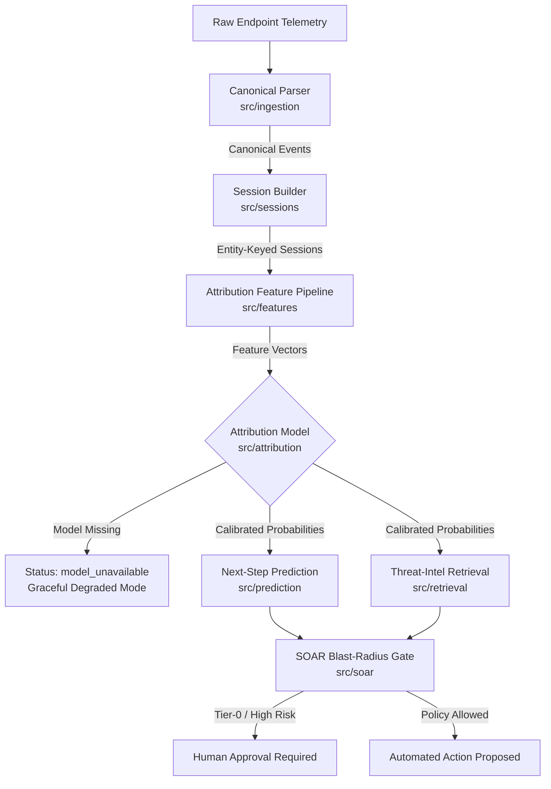

# Autonomous Security Operations Platform

A behavioral-intelligence layer for critical-infrastructure Security Operations Centers (SOCs). The platform ingests endpoint security telemetry, builds entity-keyed sessions, extracts tabular feature vectors, attributes malicious activity to MITRE ATT&CK techniques with calibrated confidence, predicts potential next-step transitions, retrieves supporting threat intelligence, simulates blast radius over a digital twin network topology, and gates automated SOAR response actions deterministically and auditably.

---

## Current Capability & Implementation Status

| Component | Status | Location | Notes |
|---|---|---|---|
| **Ingestion & Sessionisation** | Implemented | `src/ingestion/`, `src/sessions/` | Sysmon 1/3/7/10/11/12/13 + PowerShell 4103/4104; entity + logon-keyed session windows; strict timestamp parsing with drop logging. |
| **Tabular Attribution Model** | In-Progress / Scaffold | `src/attribution/`, `scripts/train_attribution.py` | HierarchicalRandomForest scaffold with Platt scaling (`CalibratedClassifierCV`). `POST /ingest/events` returns `model_unavailable` if un-fitted. |
| **UEBA Anomaly Engine** | Implemented | `src/ueba/` | Online Welford + IsolationForest anomaly detection on independent UEBA feature space. |
| **Next-Step Prediction** | Implemented | `src/prediction/`, `models/` | Data-derived ATT&CK technique transition matrix built from compound OTRF attack scenarios (`models/transition_matrix.json`). |
| **Threat-Intel Retrieval** | Implemented | `src/retrieval/` | TF-IDF / embedding similarity over ATT&CK STIX & advisories. Non-authoritative, evidence-only, non-gating. |
| **Digital Twin Simulator** | Implemented | `src/twin/` | NetworkX Dijkstra reachability analysis over static asset-topology graphs. |
| **SOAR Blast-Radius Gate** | Implemented | `src/soar/` | Deterministic policy gate. Fails safe: Tier-0 assets and un-reachable twin paths always require human approval. |
| **GNN / GraphSAGE** | Retired / Archived | `experiments/gnn/`, `archive/gnn-2026-07/` | Archived negative experimental result (macro-F1 = 0.075 for scenario-identity classification). Excluded from runtime `src/`. |

---

## Architecture Flow



---

## Quickstart (Windows PowerShell)

```powershell
# 1. Activate virtual environment
.\.venv\Scripts\Activate.ps1

# 2. Install core runtime dependencies
pip install -r requirements.txt

# 3. Verify no synthetic test fixtures are imported into production src/
python scripts/check_no_dummy_in_src.py

# 4. Run the core test suite (record output and execution date)
python -m pytest tests -q --basetemp data\pytest_tmp
```

---

## Data Acquisition & Preparation

To fetch real OTRF (Security-Datasets) telemetry and generate model artifacts:

```powershell
# Fetch MITRE ATT&CK technique metadata and scenario mappings
python scripts/fetch_otrf_metadata.py

# Inspect parameters for fetching host telemetry archives
python scripts/fetch_otrf_events.py --help

# Build the data-derived ATT&CK transition matrix artifact
python scripts/build_transition_matrix.py
```

> **Note**: Raw telemetry archives are stored under `data/raw/Security-Datasets/` and are ignored by version control.

---

## Documentation Index & Hackathon Guide

* **[Hackathon Execution Runbook](docs/HACKATHON_RUNBOOK.md)** — Step-by-step instructions for data preflight, dataset auditing, label contract setup, LOSO evaluation, and live API demonstration.
* **[Documentation Index](docs/README.md)** — Comprehensive index linking to Architecture, API Surface, Security Controls, PRD, and ML Specification.

---

## Hackathon Scope & Boundaries

* **No Synthetic Data in Runtime**: Runtime pipelines operate strictly on parsed event structures. Synthetic data generators exist only under `tests/_fixtures/` and `tests/harness_selftest/`.
* **Non-Executing SOAR Gate**: The SOAR gate determines response policies and blast radius reachability; active integration with third-party EDR/firewall APIs is out of scope.
* **Non-Gating Retrieval**: The threat intelligence retrieval module provides contextual evidence to analysts but never influences automated SOAR gate decisions.
