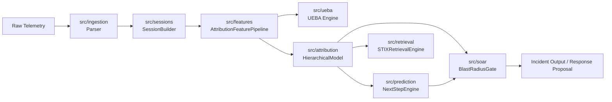

# Architecture Specification — Autonomous Security Operations Platform

This document describes the architectural component boundaries, runtime data flow, integration chains, and artifact surfaces.

---

## 1. End-to-End Pipeline Architecture (`IncidentPipeline`)

The core execution flow is encapsulated in `src/api/pipeline.IncidentPipeline`, unifying telemetry ingestion, sessionisation, feature extraction, UEBA anomaly scoring, ATT&CK attribution, next-step prediction, threat-intel retrieval, and SOAR response gating.

---

## 2. Component Boundaries & Responsibilities

| Subsystem | Location | Primary Responsibility |
|---|---|---|
| **Canonical Schema** | `src/canon/` | Single source of truth for events (`CanonicalEvent`), entities (`ProcessEntity`, `FileEntity`, etc.), sessions (`Activity`), and enums (`SourceType`, `RelationshipType`). |
| **Ingestion & Parsing** | `src/ingestion/` | Parses Sysmon (1, 3, 7, 10, 11, 12, 13) and PowerShell (4103, 4104) events. Counts drop statistics without timestamp fabrication. |
| **Sessionisation** | `src/sessions/` | Groups canonical events into entity- and logon-keyed sessions within defined time windows. Ensures sessions never span multiple hosts. |
| **Feature Extraction** | `src/features/` | Extracts 52-dimensional tabular feature vectors from session activities (`AttributionFeaturePipeline`). Fits hygiene transforms (`HygieneTransform`). |
| **ATT&CK Attribution** | `src/attribution/` | Predicts ATT&CK techniques with calibrated probabilities via `CalibratedClassifierCV`. Returns `model_unavailable` when un-fitted. |
| **UEBA Anomaly Engine** | `src/ueba/` | Computes online anomaly scores via Welford running stats and IsolationForest on an independent feature space. |
| **Next-Step Prediction** | `src/prediction/` | Calculates next-stage attack probabilities using a data-derived ATT&CK transition matrix (`transition_matrix.json`). |
| **Threat-Intel Retrieval** | `src/retrieval/` | Queries ATT&CK STIX & advisory embeddings. Non-authoritative, evidence-only, non-gating. |
| **Digital Twin Simulator** | `src/twin/` | Evaluates network reachability and blast radius via Dijkstra traversal over static NetworkX asset-topology graphs. |
| **SOAR Response Gate** | `src/soar/` | Evaluates response policies and blast-radius constraints. Fails safe by requiring manual approval on Tier-0 assets or unverified twin paths. |
| **API Application** | `src/api/` | FastAPI web layer (`app.py`), JWT authentication (`auth.py`), and end-to-end incident orchestration (`pipeline.py`). |

---

## 3. System Artifact Surface

| Artifact Path | Source Module | Purpose |
|---|---|---|
| `models/attribution.joblib` | `src/attribution/` | Persisted model artifact containing calibrated classifier, `HygieneTransform`, feature names, and version string. |
| `models/transition_matrix.json` | `src/prediction/` | Data-derived ATT&CK technique transition probability matrix built from compound OTRF scenarios. |
| Threat-Intel Corpus | `src/retrieval/` | Local ATT&CK STIX metadata and advisory documents for embedding retrieval. |
| Digital Twin Topology | `src/twin/` | Static NetworkX graph representing enterprise asset nodes, network edges, and security tiers. |

---

## 4. Experimental Boundary & Isolation Rules

* **Core `src/` Integrity**: All production runtime logic resides exclusively inside `src/`.
* **GNN Isolation (`experiments/gnn/`)**: The GraphSAGE implementation is isolated under `experiments/gnn/`. Modules under `src/` **must never import** from `experiments/gnn/`. `RelationshipType` is imported from `src.canon.schema`.
